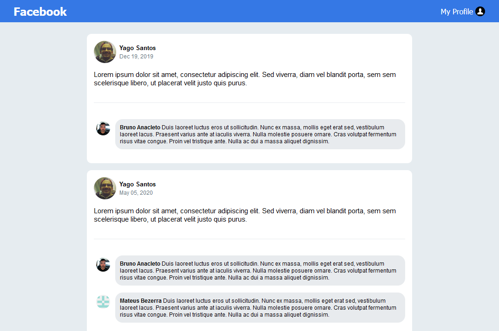

<h1 align="center">
    
</h1>

<h3 align="center">
  Challenge 04: Fundamental ReactJS Concepts
</h3>

## :rocket: About the challenge

Clone Facebok UI - post list only - using ReactJS.

<h1 align="center">
    
</h1>

## Features

This app features all the latest tools and practices in front-end development!

- **ReactJS**
- **Flexbox**
- **Babel** 
- **Webpack**

## Getting started

1. Clone this repo using `git clone https://github.com/yagosansz/rockseat-bootcamp2020-challenge04.git`
2. Go to the appropriate directory: `cd rockseat-bootcamp2020-challenge04` 
3. Run `yarn` to install dependencies 

### Getting started with the Webpack Server

1. Run `yarn dev` to start the server
2. Go to `http://localhost:8080/`